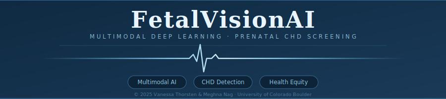
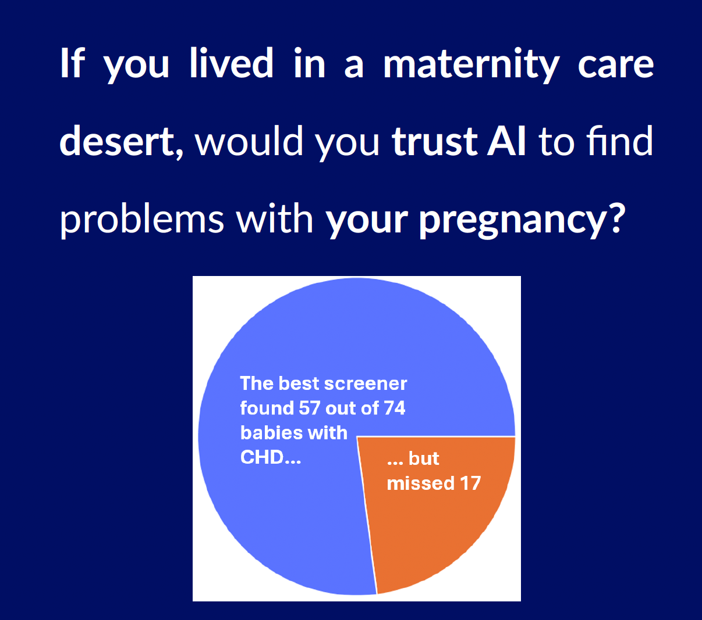
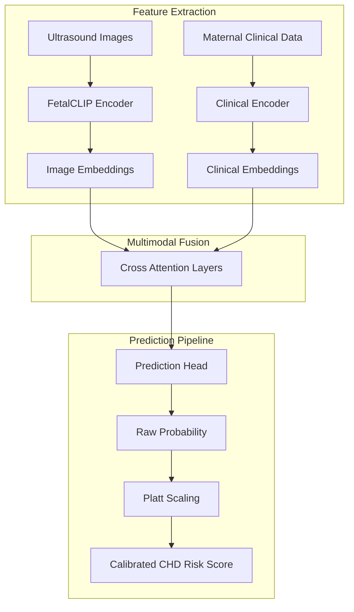
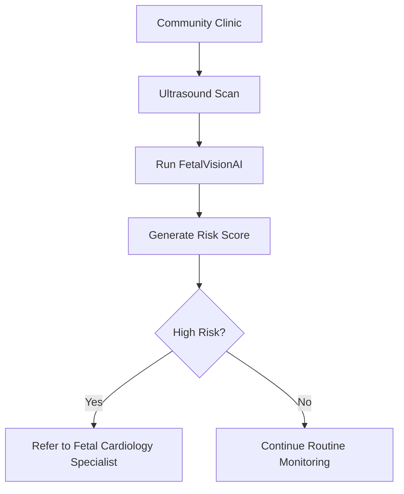

  

# FetalVisionAI: Multimodal Deep Learning for Prenatal CHD Screening

**FetalVisionAI** is a multimodal deep learning system designed to estimate **patient-level congenital heart disease (CHD) risk** by combining prenatal ultrasound imaging with maternal clinical data. Rather than relying on imaging alone, the system integrates fetal ultrasound image patterns with maternal clinical indicators to produce calibrated risk scores that support specialist referral decisions.

The goal is to create a more reliable prenatal screening workflow that identifies high-risk pregnancies earlier and more accurately. Because CHD is a relatively rare condition, many traditional models can achieve acceptable accuracy while still missing positive cases — and in prenatal care, a false negative can delay diagnosis, delivery planning, and access to specialized neonatal treatment.

## Video Presentation

> 📽️ **[Watch the Project Presentation](https://youtu.be/BVuTtLNryqk)**

*Replace the link above with your YouTube, Google Drive, or any public video URL.*

## Why This Project Matters

  

### The Human Question Behind This Work

What if you were pregnant and lived in a maternity care desert? Would you need to spend hours traveling for specialist screening, incurring financial cost and uncertainty before knowing whether you were truly high risk?

Approximately **40% of counties in Colorado** lack prenatal or delivery services, creating maternity care deserts where patients must travel long distances across mountain roads for specialized screening and care. For many families, this means delayed specialist evaluation, significant travel costs, limited appointment availability, and unequal healthcare outcomes.

FetalVisionAI explores how AI-assisted screening could support rural clinics, community hospitals, mobile maternal care units, and traveling sonographers by enabling early triage without requiring every patient to travel first.

**Can risk be estimated locally first? Can AI help reduce missed CHD cases while avoiding unnecessary travel?**

FetalVisionAI was built around these real-world questions.

## Existing Challenges in Current Screening Workflows

Specialist interpretation is not always available in rural settings, and many existing AI tools are expensive or not publicly accessible. Image-only systems often ignore important clinical context, while most models optimize for overall accuracy rather than reducing missed cases. Uncalibrated probability scores also make real referral decisions difficult to act on in practice.

## Our Approach & Design Decisions

The system was trained using labeled fetal ultrasound images and maternal clinical data from the CARDIUM dataset, combined with pretrained FetalCLIP image embeddings. Three loss functions — BCE, Weighted BCE, and Focal Loss — were evaluated under identical architectures to isolate the effect of each on rare disease detection.

Sensitivity was prioritized throughout because earlier CHD detection improves referral timing, delivery planning, neonatal specialist readiness, and access to early intervention.

## How It Works

Raw ultrasound imaging and clinical history are processed through pretrained encoders that transform each modality into meaningful embeddings. A cross-attention fusion layer combines image and clinical context for richer decision-making. A prediction head estimates raw disease probability, which is passed through Platt scaling to improve the trustworthiness of the final scores — producing a referral-ready CHD risk estimate.

## Why Multimodal AI Matters

### Image-only models

May miss important maternal history or structured risk indicators.

### Clinical-only models

Cannot capture anatomical abnormalities visible in ultrasound scans.

### FetalVisionAI

Combines both modalities together, allowing the model to learn interactions between imaging findings and patient context.

## Dataset Details

| Attribute | Value |
|---|---|
| Total Images | 6,558 |
| Total Patients | 1,103 |
| Prediction Target | Patient-level CHD risk |
| Inputs | Imaging + Clinical Data |
| CHD Prevalence | 7.19% |

Data were split at the patient level to prevent leakage, ensuring images from the same patient did not appear across training, validation, and test sets.

## Training Strategy

| Loss Function | Purpose |
|---|---|
| BCE | Standard baseline classification |
| Weighted BCE | Penalizes missed CHD cases more heavily |
| Focal Loss | Focuses learning on hard minority examples |

A model can appear statistically strong while still failing clinically if it misses too many positive cases. This project evaluates models through a **healthcare screening lens**, not just generic benchmark accuracy.

## Final Results

| Model | Sensitivity | Specificity | AUROC | AUPRC |
|---|---:|---:|---:|---:|
| BCE Baseline | 0.797 | 0.491 | 0.773 | 0.480 |
| Weighted BCE | 0.757 | 0.737 | 0.799 | 0.327 |
| **Focal Loss** | **0.770** | **0.688** | **0.814** | **0.522** |

A model can appear statistically strong while still failing clinically if it misses too many positive cases. This project evaluates models through a **healthcare screening lens**, not just generic benchmark accuracy.

## Key Findings

- BCE detected many CHD cases but created more unnecessary follow-ups  
- Weighted BCE emphasized positives but increased referral burden  
- Focal Loss produced the best overall balance between detection and efficiency  

## Real World Deployment Vision

FetalVisionAI is designed to support traveling sonographers performing first-line scans in rural communities, flagging the highest-risk pregnancies before any long-distance travel occurs.

## Potential Impact

If externally validated, systems like this could help reduce missed prenatal CHD cases, improve maternal healthcare access in underserved regions, prioritize specialist resources, lower unnecessary travel burden, and support earlier intervention planning for families in maternity care deserts.

## Future Work

Planned extensions include external hospital validation, explainability using SHAP and attention maps, cloud or mobile deployment, clinician-in-the-loop workflows, and federated privacy-preserving learning across health systems.

## Disclaimer

> This repository represents a graduate academic research project. It is **not** an FDA-approved medical device and should not be used for diagnosis or treatment without regulatory review, external validation, and clinician oversight.

## Authors

**Vanessa Thorsten · Meghna Nag**
*University of Colorado Boulder — 2025*

© 2025 Vanessa Thorsten & Meghna Nag. All rights reserved.
