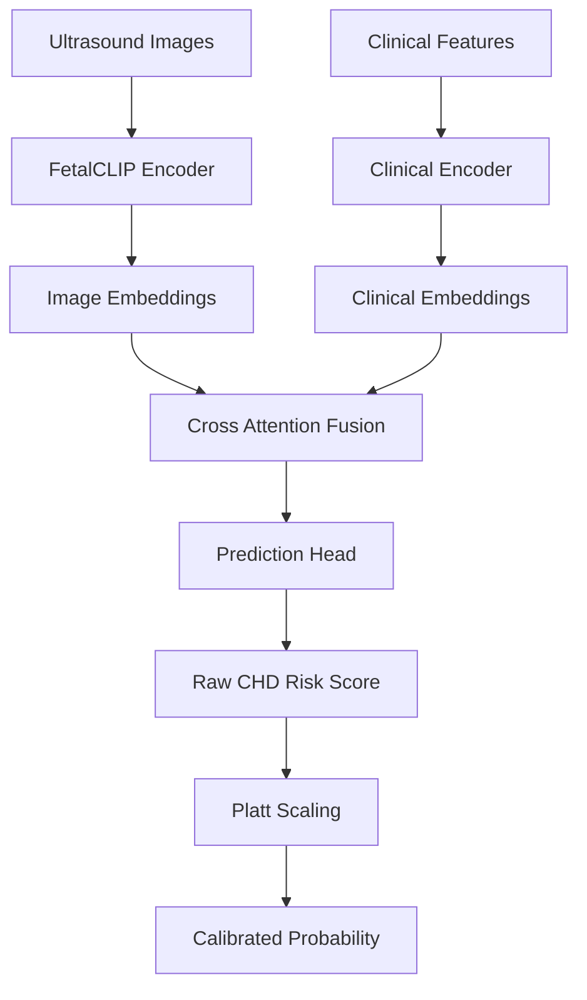
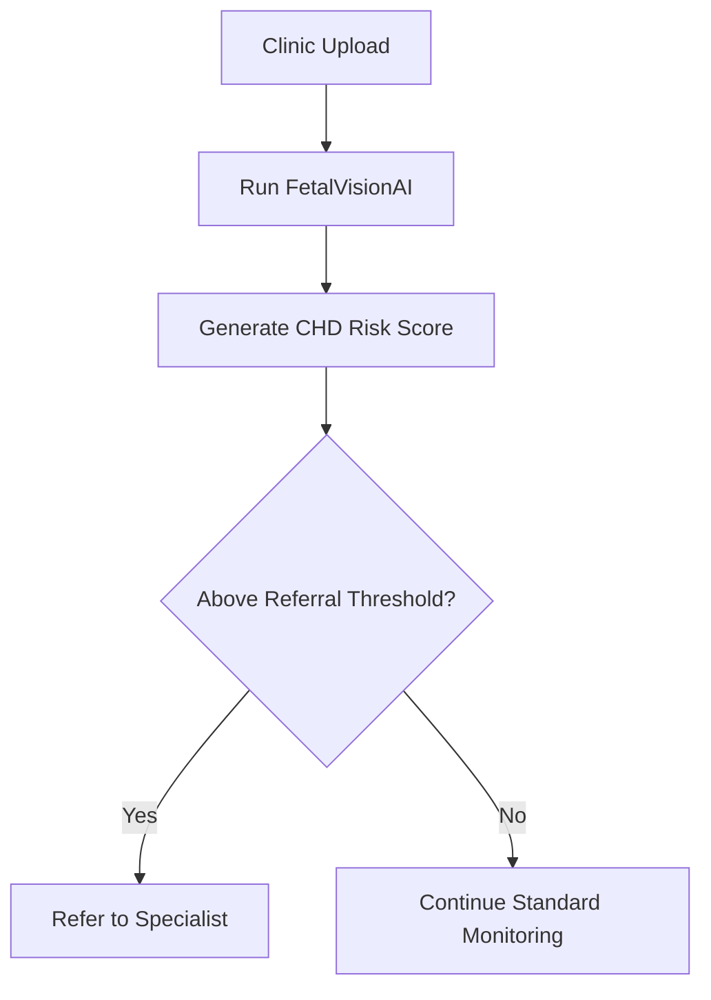

# FetalVisionAI

AI-assisted prenatal congenital heart disease screening using multimodal ultrasound imaging and clinical data.

Helping clinicians identify fetal heart risk earlier through scalable screening workflows designed for specialist-limited and underserved care settings.

FetalVisionAI combines medical imaging intelligence with structured clinical context to estimate congenital heart disease (CHD) risk before birth.

Like traditional screening, but smarter. Traditional workflows rely heavily on image quality, specialist availability, and manual review. FetalVisionAI adds multimodal AI support through image embeddings, clinical fusion, calibrated risk scoring, and referral-aware thresholding.

## TL;DR

FetalVisionAI is a research-driven multimodal deep learning system built using the CARDIUM dataset.

It combines:

- **FetalCLIP** ultrasound image embeddings  
- maternal and patient clinical features  
- cross-attention fusion modeling  
- focal loss for rare disease detection  
- calibrated probability outputs  
- threshold tuning for screening workflows

Best performing model:

| Metric | Score |
|---|---:|
| Sensitivity | 0.770 |
| Specificity | 0.688 |
| AUROC | 0.814 |
| AUPRC | 0.522 |

This balance is important because healthcare screening systems must detect positive cases while minimizing unnecessary referrals.

## Why This Project Matters

Congenital heart disease is one of the most common birth defects. Earlier prenatal detection can improve:

- delivery planning  
- neonatal specialist readiness  
- postnatal treatment timing  
- patient monitoring during pregnancy  
- family preparedness

However, expert fetal cardiology access may be limited in:

- rural hospitals  
- smaller clinics  
- underserved maternal care regions  
- traveling sonographer workflows

FetalVisionAI explores how AI-assisted triage can help bridge that gap.

## What FetalVisionAI Does

FetalVisionAI receives two sources of information:

### Ultrasound Understanding

Fetal ultrasound images are encoded using a pretrained medical vision model (**FetalCLIP**) that captures anatomical patterns from imaging data.

### Clinical Understanding

Structured maternal and patient variables are encoded into clinical embeddings representing non-image risk signals.

### Multimodal Fusion

Both streams are combined through a neural network fusion layer that learns how imaging findings and clinical context interact.

### Risk Prediction

The final system outputs a calibrated CHD risk probability that can support referral decisions.

## How It Works



## Dataset

This project uses the CARDIUM fetal imaging dataset.

| Attribute | Value |
|---|---|
| Images | 6,558 fetal cardiac ultrasound images |
| Patients | 1,103 |
| Data Type | Imaging + Clinical |
| CHD Prevalence | 7.19% |

The dataset supports patient-level multimodal learning across both imaging and tabular inputs.

## Training Strategy

Three loss functions were tested under the same architecture:

| Method | Purpose |
|---|---|
| BCE | Standard binary classification baseline |
| Weighted BCE | Increased emphasis on minority positive class |
| Focal Loss | Better handling of hard rare positive examples |

Why this matters:

Rare disease prediction is highly imbalanced. A model may appear accurate while still missing important positive cases.

## Final Results

| Model | Sensitivity | Specificity | AUROC | AUPRC |
|---|---:|---:|---:|---:|
| BCE | 0.797 | 0.491 | 0.773 | 0.480 |
| Weighted BCE | 0.757 | 0.737 | 0.799 | 0.327 |
| Focal Loss | 0.770 | 0.688 | 0.814 | 0.522 |

## Why Focal Loss Won

Focal loss delivered the strongest practical screening tradeoff:

- strong CHD detection performance
- reduced false positive burden
- best ranking performance
- better rare class learning behavior

This makes it the most deployment-relevant model among tested approaches.

## Why This Can Be Better Than Many Existing Approaches

Many traditional pipelines depend on:

- image-only review
- manual interpretation bottlenecks
- specialist scarcity
- uncalibrated predictions
- one-size-fits-all thresholds

FetalVisionAI introduces:

| Capability | Benefit |
|---|---|
| Multimodal Inputs | Uses image + clinical context |
| Calibration | More reliable probabilities |
| Threshold Tuning | Adaptable referral strategy |
| Rare Disease Optimization | Better positive detection |
| Scalable Workflow | Supports lower-resource settings |

## Deployment Vision



## Potential Real World Impact

If externally validated, systems like this could help:

- reduce missed CHD cases
- prioritize specialist resources
- improve prenatal access equity
- support sonographers in remote settings
- improve earlier referral pathways

## Repository Structure

```text
FetalVisionAI/
├── notebooks/
├── src/
├── results/
├── reports/
├── presentation/
└── data/
```

## Tech Stack

- Python
- PyTorch
- Scikit-learn
- Pandas / NumPy
- Jupyter Notebooks
- Medical Vision Embeddings
- Multimodal Deep Learning

## Important Note

This repository is for research and educational purposes only.

It is not a medical device and should not be used for diagnosis or treatment without external validation, regulatory review, and clinician oversight.

## Authors

Vanessa Thorsten  
Meghna Nag  
University of Colorado Boulder
