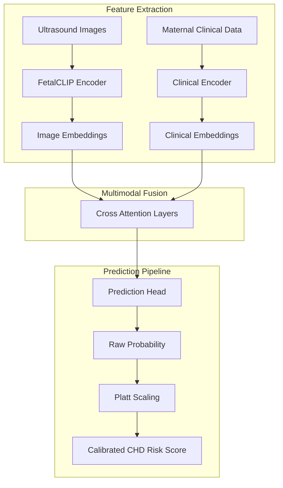
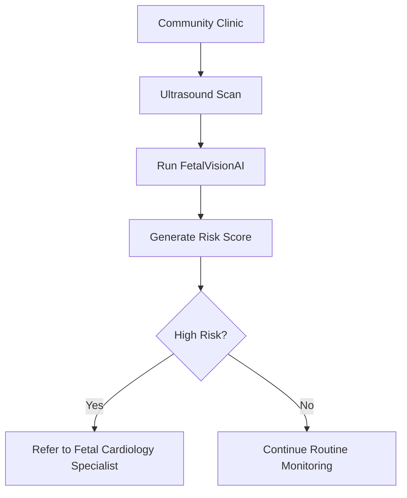

  

**FetalVisionAI** is a multimodal deep learning system designed to estimate **patient-level congenital heart disease (CHD) risk** by combining prenatal ultrasound imaging with maternal clinical data.

Rather than relying on imaging alone, this project integrates two complementary sources of information:

- fetal ultrasound image patterns  
- maternal and patient clinical indicators  
- calibrated risk scoring for referral support  
- multimodal learning for stronger screening decisions  

The goal is to create a more reliable prenatal screening workflow that helps identify pregnancies needing specialist follow-up earlier and more accurately.

Because CHD is a relatively rare condition, many traditional models can achieve acceptable accuracy while still missing positive cases. In prenatal care, a false negative can delay diagnosis, delivery planning, and access to specialized neonatal treatment.

## Why This Project Matters

  

Approximately **40% of counties in Colorado** lack prenatal or delivery services, creating maternity care deserts where patients may need to travel long distances across mountain roads for specialized screening and care.

For many families, this can mean:

- delayed specialist evaluation  
- additional travel cost  
- limited appointment availability  
- stress during pregnancy  
- unequal healthcare outcomes  

FetalVisionAI explores how AI-assisted screening could support:

- rural clinics  
- community hospitals  
- mobile maternal care units  
- traveling sonographers  
- early triage workflows  

## The Human Question Behind This Work

What if you were pregnant and lived in a maternity care desert?

Would you need to spend hours traveling for specialist screening?

Would you incur the financial cost, time burden, and uncertainty before knowing whether you were truly high risk?

Can risk be estimated locally first?

Can AI help reduce missed CHD cases while avoiding unnecessary travel?

## Existing Challenges in Current Screening Workflows

- specialist interpretation is not always available  
- some AI tools are expensive or not publicly accessible  
- image-only systems may ignore clinical context  
- many models optimize overall accuracy rather than missed-case reduction  
- uncalibrated scores may not support real referral decisions  

## Our Approach & Design Decisions

The system was trained using:

- labeled fetal ultrasound images  
- maternal clinical data  
- CARDIUM dataset records  
- pretrained FetalCLIP image embeddings  

Sensitivity was prioritized because earlier detection can improve:

- referral timing  
- delivery planning  
- neonatal specialist readiness  
- early intervention access  

## How It Works

This workflow converts raw ultrasound imaging and clinical history into a calibrated patient-level CHD risk score.

## Why Multimodal AI Matters

### Image-only models

May miss important maternal history or structured risk indicators.

### Clinical-only models

Cannot capture anatomical abnormalities visible in ultrasound scans.

### FetalVisionAI

Combines both modalities together, allowing the model to learn interactions between imaging findings and patient context.

## Dataset Details

| Attribute | Value |
|---|---|
| Total Images | 6,558 |
| Total Patients | 1,103 |
| Prediction Target | Patient-level CHD risk |
| Inputs | Imaging + Clinical Data |
| CHD Prevalence | 7.19% |

## Training Strategy

| Loss Function | Purpose |
|---|---|
| BCE | Standard baseline classification |
| Weighted BCE | Penalizes missed CHD cases more heavily |
| Focal Loss | Focuses learning on hard minority examples |

## Final Results

| Model | Sensitivity | Specificity | AUROC | AUPRC |
|---|---:|---:|---:|---:|
| BCE Baseline | 0.797 | 0.491 | 0.773 | 0.480 |
| Weighted BCE | 0.757 | 0.737 | 0.799 | 0.327 |
| Focal Loss | 0.770 | 0.688 | 0.814 | 0.522 |

## Key Findings

- BCE detected many CHD cases but created more unnecessary follow-ups  
- Weighted BCE emphasized positives but increased referral burden  
- Focal Loss produced the best overall balance between detection and efficiency  

## Real World Deployment Vision

## Potential Impact

- reduce missed prenatal CHD cases  
- improve maternal healthcare access  
- prioritize specialist resources  
- lower unnecessary travel burden  
- support earlier intervention planning  
- improve healthcare equity in underserved regions  

## Future Work

- external hospital validation  
- explainability using SHAP / attention maps  
- cloud or mobile deployment  
- clinician-in-the-loop workflows  

## Disclaimer

It is **not** yet an FDA-approved medical device and should not be used for diagnosis or treatment without regulatory review, external validation, and clinician oversight.

## Authors

Vanessa Thorsten  
Meghna Nag  
University of Colorado Boulder
