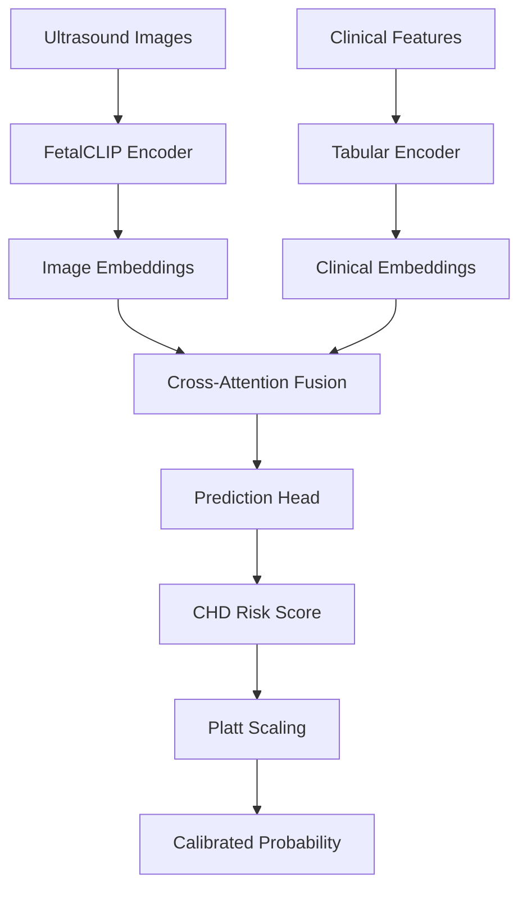
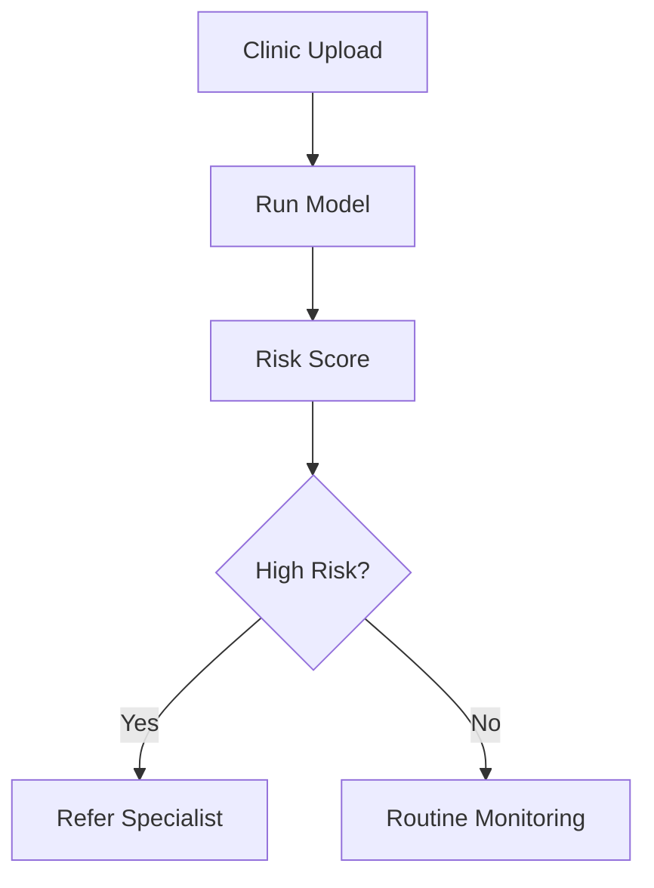

# SafeFetalVision

AI-assisted prenatal congenital heart disease (CHD) screening using multimodal ultrasound and clinical data.

Building safer fetal screening workflows for earlier CHD detection in underserved and rural maternal care settings.

---

## TL;DR

SafeFetalVision is a multimodal deep learning project that combines fetal ultrasound image embeddings from **FetalCLIP** with patient-level clinical/tabular embeddings from the **CARDIUM** dataset to estimate congenital heart disease risk.

The system compares **Binary Cross Entropy**, **Weighted BCE**, and **Focal Loss** under the same architecture, followed by **Platt scaling** and threshold tuning for high-sensitivity screening.

**Best model: Focal Loss**

| Metric | Score |
|---|---:|
| Sensitivity | 0.770 |
| Specificity | 0.688 |
| AUROC | 0.814 |
| AUPRC | 0.522 |

---

## The Problem

Congenital heart disease is one of the most common birth defects. Early prenatal detection improves referral planning, delivery preparation, neonatal intervention, and postnatal outcomes.

However, access to fetal cardiology specialists can be limited in rural and underserved regions.

SafeFetalVision explores how AI-assisted screening can support clinicians by identifying pregnancies that may benefit from specialist follow-up.

---

## Dataset

This project uses the **CARDIUM** fetal imaging dataset.

- 6,558 fetal cardiac ultrasound images
- 1,103 patients
- Patient-linked clinical variables
- Oversampled CHD prevalence of 7.19%

---

## System Architecture

---

## Results

| Model | Sensitivity | Specificity | AUROC | AUPRC |
|---|---:|---:|---:|---:|
| BCE | 0.797 | 0.491 | 0.773 | 0.480 |
| Weighted BCE | 0.757 | 0.737 | 0.799 | 0.327 |
| Focal Loss | 0.770 | 0.688 | 0.814 | 0.522 |

---

## Future Vision

---

## Authors
Vanessa Thorsten
Meghna Nag  
University of Colorado Boulder
